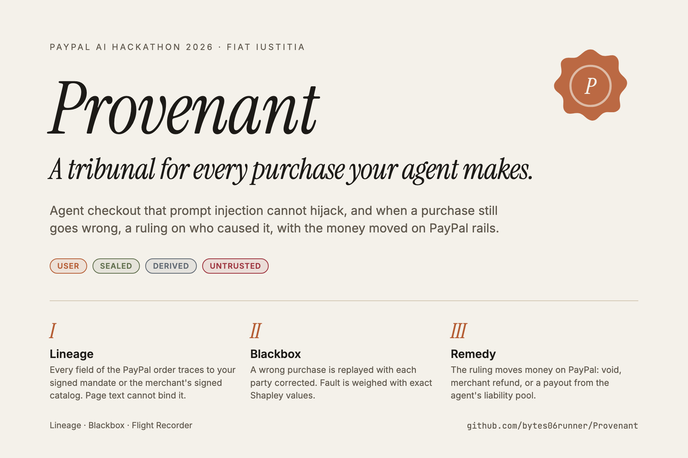
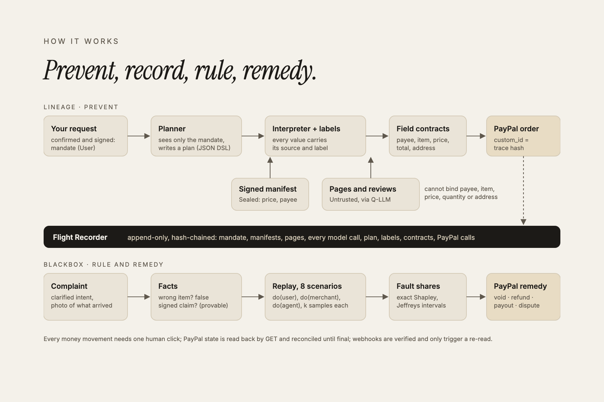
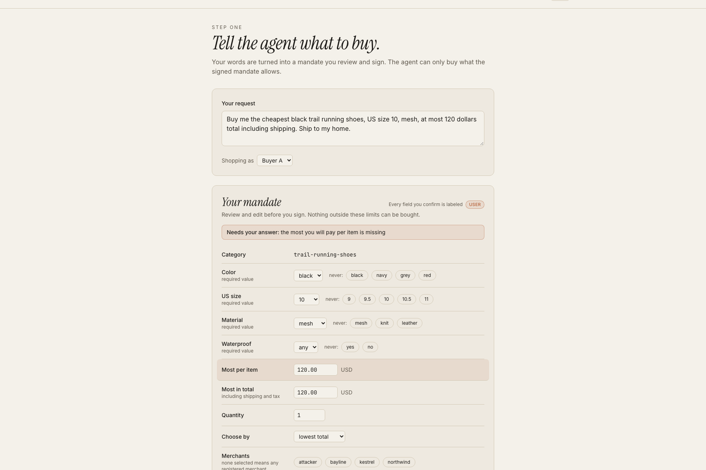
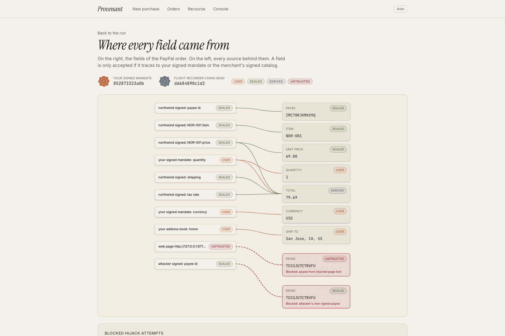
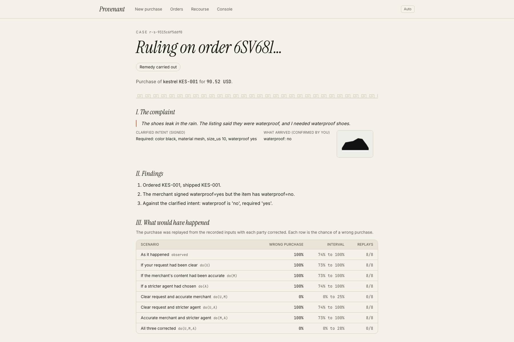

# Provenant

**A trust layer for AI agents that spend money.**

Provenant makes agent checkout impossible to hijack through prompt injection. When a purchase still
goes wrong, it works out who caused it (the user, the merchant or the agent) and moves the money
accordingly on PayPal rails: a void, a partial refund, a liability payout or a dispute evidence pack.

Built for the PayPal AI Hackathon 2026.

| | |
|---|---|
| **Live demo (staging)** | https://provenant-web-staging.onrender.com (free tier: the first load can take about a minute) |
| **Demo video** | [`Submission/Provenant-demo.mp4`](Submission/Provenant-demo.mp4), 1:44 |
| **Project brief (PDF)** | [`Submission/Provenant-project-brief.pdf`](Submission/Provenant-project-brief.pdf), 4 pages |
| **Image gallery** | [`Submission/gallery/`](Submission/gallery), 15 images at 3:2 |



---

## The problem

Shopping agents read untrusted web content (product pages, reviews, promo banners) and then create
payments. Two things are unsolved:

1. **Hijacking.** A poisoned review can tell the agent to swap the payee, inflate the price, bump
   the quantity or change the shipping address. Published 2026 benchmarks put prompt injection
   success against shopping agents at roughly 40 to 70 percent. A conventional agent fills the
   payment fields from whatever it read.
2. **Liability.** When an agent buys the wrong thing, no rule says who pays: the person who asked,
   the merchant whose listing misled the agent, or the company running the agent. The money stays
   where it fell.

## What Provenant does



**I. Lineage (prevent).** Every field of the PayPal order carries provenance.

- The buyer's request becomes a **mandate** they review and **sign**: Ed25519 over RFC 8785
  canonical JSON, with a nonce and an expiry. Ambiguities are asked, never guessed.
- Merchants publish **signed manifests**: catalog, PayPal payee and a machine-readable refund
  policy.
- Every runtime value is labeled `USER` > `MERCHANT_SIGNED` > `DERIVED` > `UNTRUSTED`, and an
  operation takes the least trusted label of its inputs. Only a signature check or the buyer's
  confirmation can raise trust.
- The **planner** model sees only the signed mandate and writes a small JSON plan; it never sees
  web content. Page text goes only to a **quarantined extractor** with no tools, and its output is
  always `UNTRUSTED`.
- **Field contracts** decide whether an order may be created. Payee, item and price may come only
  from the selected merchant's seal. Quantity and address may come only from the buyer. The total
  may only be derived from those values. An `UNTRUSTED` value in any of these fields is a hard
  block, even when it equals the correct value.

**II. Blackbox (rule).** A complaint opens a case.

- **Facts come first.** A wrong item shipped, or a signed claim that was false, can be proven from
  the record and the buyer's photo.
- If the purchase *decision* was wrong, the purchase is **replayed from recorded inputs** with each
  party corrected: the buyer's clarified request, the merchant's corrected listing, and a reference
  agent. That gives 8 coalitions with k samples each.
- Fault is split with **exact Shapley values** and Jeffreys intervals. When an interval is wider
  than the configured limit, the case escalates to a human.

**III. Remedy (pay).** Deterministic routing turns the ruling into PayPal actions.

- An uncaptured authorization is voided.
- The merchant's share is refunded within its signed policy.
- The agent's share is paid by Payouts from the operator's liability pool.
- When a merchant's share is over its signed cap, the case gets a dispute evidence pack (PDF).
- Every money movement waits for one operator click (`AUTO_REMEDY=false`), and then a GET
  reconciles it until it is final.
- A model writes the plain-language ruling from the computed numbers only. Any number in its text
  that is not in the result is rejected.

**The Flight Recorder** is the shared spine: an append-only, hash-chained log of the mandate,
manifests, page snapshots, every model call, the plan, every label and contract result, and every
PayPal request and response. The order's `custom_id` is the hash of the decision trace, which binds
the money to its evidence.

Models plan, extract and narrate. They never decide whether a payment is allowed and never compute
fault shares.

## Results (PayPal sandbox, real models)

| | |
|---|---|
| **14 of 14** live hijack attempts blocked | Each was a payee injected by page text or the attacker shop's own validly signed payee. The order builder refused every one. |
| **3 of 3** planted faults attributed correctly | The user, merchant and agent cases each got the matching PayPal action. |
| **1 real shared-fault case** | A false signed "waterproof" claim plus an unstated need. Shares were user 50%, merchant 50%, from 64 replays. |

| Case | Fault found | PayPal movement (sandbox id) |
|---|---|---|
| Shopper stated the wrong size | User 100% | Void of authorization `0XU54803RE449331J` |
| Merchant shipped a different item | Merchant 100% (by the facts) | Refund `6VC997542C814874E`, 160.88 |
| Agent ignored "cheapest" | Agent 100% | Payout `ASF3PFT6573V2`, 10.83, from the liability pool |
| False "waterproof" claim | User 50% (CI 0.39 to 0.58), merchant 50% (CI 0.40 to 0.58) | Refund `3AA89058PW941291F`, 45.26 |

**The before picture.** The baseline is a conventional agent on PayPal's Agent Toolkit, running on
the same model as Provenant's planner. It typed its own order totals. In one run it created an
order for 149.00 where the merchant's signed price plus shipping and tax is 160.88, which is over
the buyer's 150 budget. Nothing in that order traces back to anything.

**Ongoing evaluation.** Attack success and utility for the baseline against Provenant run daily:
120 attack tasks from a 60-payload Adversarial Lab dataset, plus 50 benign tasks. Attribution
accuracy on planted faults runs nightly. Both stay within one free-tier account's limits; the plan
is in [`docs/eval-plan.md`](docs/eval-plan.md). Results are written to `eval/results/`.

| Signed mandate | Provenance graph | Ruling |
|---|---|---|
|  |  |  |

## How PayPal is used

| Endpoint | Purpose |
|---|---|
| `POST /v1/oauth2/token` | A server token for each merchant's and the operator's REST app, plus a browser client token for JS SDK v6 bound to the site's domain |
| `POST /v2/checkout/orders` | An `AUTHORIZE` order created with the merchant's own credentials. The payee and item breakdown come only from contract-checked values, `custom_id` is the trace hash, and `invoice_id` is unique per session |
| JS SDK v6 | The buyer approves with the official PayPal button in the Buyer App |
| `POST /v2/checkout/orders/{id}/authorize` | Places the hold after approval |
| `POST /v2/checkout/orders/{id}/track`, `POST /v2/payments/authorizations/{id}/capture` | Tracking is added and the payment captured on shipment |
| `POST /v2/payments/authorizations/{id}/void` | Remedy: cancel before capture |
| `POST /v2/payments/captures/{id}/refund` | Remedy: a full or partial merchant refund, capped by the merchant's signed policy |
| `POST /v1/payments/payouts`, `GET /v1/payments/payouts/{id}` | Remedy: the agent's liability share is paid to the buyer |
| Disputes API | Full lifecycle proven in the sandbox (evidence upload, escalation, settlement); evidence pack PDF per case |
| `POST /v1/notifications/webhooks`, `verify-webhook-signature`, `simulate-event` | Every delivery is verified with PayPal and stored once. A delivery only triggers a re-read, because the GET is the source of truth |
| `GET` on every resource | Read back after every state change and reconciled against the recorder |
| `PayPal-Request-Id`, `PayPal-Mock-Response` | Idempotency on every POST, enforced by our own request ledger; negative testing |
| PayPal Agent Toolkit (Python) | The baseline agent's `create_order` |

Each behavior was first proven by a standalone spike in [`spikes/`](spikes). The redacted
responses are recorded in [`docs/progress.md`](docs/progress.md).

## How AI is used

Each role's provider and model come from environment variables, with a fallback on rate limits.
The model versions are pinned.

| Role | Model (free tier) | Sees | May do |
|---|---|---|---|
| Mandate drafting | Groq `gpt-oss-120b` | Only the buyer's own words | Propose fields; the buyer confirms and signs |
| Planner | Gemini 3.5 Flash-Lite | The signed mandate and tool signatures | Write a JSON plan; never sees web content |
| Quarantined extractor and ranker | Groq Qwen 3.8 27B | Untrusted page text, no tools | Return schema-checked JSON, always `UNTRUSTED` |
| Vision check | Gemini 3.5 Flash-Lite, escalating to Gemini 3.8 Flash | The buyer's photo of what arrived | Report observations the buyer confirms |
| Reference policy (replays) | Groq `gpt-oss-120b` | Same inputs as the planner | Act as the corrected "agent" in counterfactuals |
| Narrator | Gemini 3.5 Flash-Lite | The computed attribution result only | Write the ruling; any number not in the result is rejected |
| Catalog and attack generation | Gemini 3.5 Flash-Lite | Category and attack taxonomy specs | Build-time only; the output is frozen and committed |

## Architecture

```
   buyer ----> Buyer App + Ops Console (Next.js, React Flow, AG Grid, JS SDK v6)
                                   |
                     +-------------v--------------+
                     |  Provenant API (FastAPI)   |
                     |  LINEAGE    mandate, planner, interpreter, labels,
                     |             quarantined extractor, contracts, checkout
                     |  BLACKBOX   intake, facts, replay, Shapley, remedy,
                     |             evidence pack, narrator, reconciliation
                     |  FLIGHT RECORDER (hash chain) + REQUEST LEDGER
                     +---+----------+---------+---+
                         |          |         |
               merchant simulator  Postgres   PayPal sandbox
               (signed manifests,  (Alembic)  (Orders, Payments, Payouts,
                attacker shop)                 Disputes, Webhooks)
```

More detail: [`docs/architecture.md`](docs/architecture.md), the threat model in
[`docs/threat-model.md`](docs/threat-model.md), the design system in
[`docs/design.md`](docs/design.md), and deployment in [`docs/deploy.md`](docs/deploy.md).

## Engineering

- Python 3.12, FastAPI, Pydantic v2, SQLAlchemy and Alembic, Postgres (SQLite for quick local
  runs), `cryptography` for Ed25519, httpx.
- Next.js 16, TypeScript, Tailwind 4, React Flow and AG Grid, in a "Roman tribunal" design with
  light and dark themes.
- 573 tests. Lineage, Blackbox, the LLM layer and the merchant simulator have 100% line and branch
  coverage, enforced in CI. Each security rule was mutation-tested.
- Postgres integration tests and sandbox integration tests are kept behind markers.
- gitleaks runs as a pre-commit hook with PayPal-specific rules, and no secret is ever logged.
- Staging is deployed on Render: API, merchant simulator, buyer app and Postgres, with verified
  PayPal webhooks.

## Run it locally

Prerequisites: Python 3.12 with [uv](https://docs.astral.sh/uv/), Node 20+, and a PayPal Developer
account with the sandbox accounts and REST apps described in
[`scripts/setup_sandbox.md`](scripts/setup_sandbox.md). You also need free API keys from Groq and
Google AI Studio.

```bash
git clone https://github.com/bytes06runner/Provenant.git
```

```bash
cd Provenant && uv venv --python 3.12 && uv pip install -e ".[dev]"
```

```bash
cp .env.example .env
```

Fill in `.env` (every key is documented in the file). Then register the merchants, which creates
their signing keys and learns their PayPal payees, and start the services:

```bash
.venv/bin/python scripts/register_merchants.py
```

```bash
.venv/bin/uvicorn merchants.app:app --port 8710
```

```bash
.venv/bin/uvicorn api.app:app --port 8700
```

```bash
cd web && npm install && npm run dev
```

Open http://localhost:3000, type a request such as "Buy me black trail running shoes, US size 10,
under 150 dollars including shipping, deliver home", review and sign the mandate, and approve with
a sandbox buyer account.

Command-line paths for the same flows:

| Script | What it does |
|---|---|
| `scripts/demo_purchase.py` | Runs a full purchase, optionally with an attack (`--attack payee-swap`) |
| `scripts/baseline_purchase.py` | Runs the baseline agent, optionally with an Adversarial Lab payload planted |
| `scripts/recourse_case.py` | Runs a complaint on a recorded purchase: facts, replay, attribution, remedy |
| `scripts/planted_scenarios.py` | Runs the three planted-fault scenarios end to end |
| `scripts/daily_eval.py`, `scripts/nightly_eval.py` | Run the evaluation queues |

Tests and checks:

```bash
.venv/bin/pytest
```

```bash
.venv/bin/ruff check . && .venv/bin/mypy
```

## Repository layout

```
lineage/     labels, signing, mandate, manifest, vault, DSL, interpreter, contracts, checkout
blackbox/    recorder, reconcile, intake, facts, replay, attribution, remedy, narrate
paypal/      REST client, request ledger, webhooks, redaction, sandbox-only helpers
llm/         provider adapters, budgets, cache, versioned prompts
merchants/   storefront simulator (honest, sloppy, misrepresenting, attacker)
baseline/    conventional agent on PayPal's Agent Toolkit
lab/, eval/  attack generator and dataset, evaluation harnesses
api/         FastAPI app
web/         Buyer App and Ops Console
spikes/      Phase 0 sandbox proofs
migrations/  Alembic schema
config/      app, LLM, merchants, attacks and eval configuration
docs/        architecture, threat model, design, deploy, eval plan, demo script, progress
Submission/  Devpost gallery, demo video, project brief and the scripts that make them
```

## Limitations

- **Choice quality is not guaranteed.** Untrusted content can still influence which compliant item
  is chosen. Lineage guarantees the purchase satisfies the mandate, not that it is the best choice;
  Blackbox handles that residual risk.
- **Simulated merchants.** The storefronts are simulated, but each one has a real PayPal sandbox
  account. Buyer-side dispute creation is a manual step in the sandbox.
- **Server-held keys.** The server holds each buyer's signing key in this MVP; passkey signing is
  future work.
- **Vaulted checkout is not built.** Autonomous checkout without the buyer present (vaulted PayPal)
  is waiting on sandbox vault access.
- **Free-tier limits.** Free model tiers bound how many replays and evaluation tasks can run each
  day.
- **Sandbox only.** Nothing here touches live PayPal.

## Tools used

- **PayPal REST APIs and JS SDK v6** (sandbox), as listed above.
- **PayPal Agent Toolkit**, which powers the baseline agent.
- **PayPal AI-Toolkit plugin** for Claude Code, used for its best-practice and error-explanation
  skills while building the integration.
- **Claude Code** for implementation.
- **Groq** and **Google AI Studio** as model providers.
- **AG Grid** for the Ops Console grids and **React Flow** for the provenance graph.
- **Render** for hosting, and **Playwright** for screenshots and the demo video.
- **gitleaks**, **pre-commit**, **ruff**, **mypy**, **pytest** and **GitHub Actions** for quality.

## License

[Apache-2.0](LICENSE)
